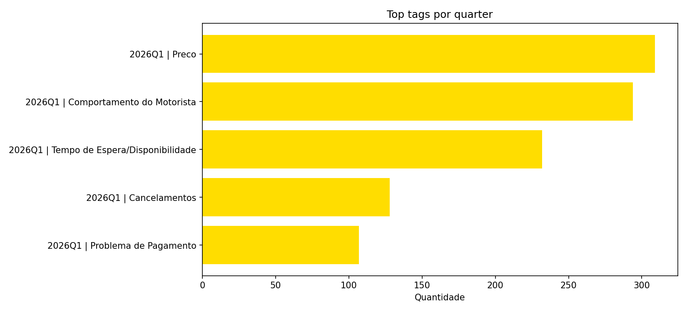

# Documentacao Executiva - Percepcao de Usuarios no X (99)

Gerado automaticamente em 29/04/2026 16:28.

## Base de dados e dicionario de colunas
- Base completa: [Google Sheets](https://docs.google.com/spreadsheets/d/1If2wWa5sSXJTmc5J2O6DfCPb8naOm5oGvhHSZFt8iLY/edit?usp=sharing)
- `id_tweet`: id da mensagem. Ao copiar o id e colar apos a URL do X, voce e redirecionado para a respectiva mencao no site oficial.
- `created_date`: data da publicacao.
- `created_time`: hora da publicacao.
- `full_text`: texto da publicacao onde a 99 foi mencionada.
- `view_count`: quantidade de visualizacoes.
- `retweet_count`: quantidade de reposts.
- `favorite_count`: quantidade de curtidas.
- `reply_count`: quantidade de respostas.
- `quote_count`: quantidade de citacoes.
- `id_user`: id da conta do usuario.
- `followers_count`: contagem de seguidores.
- `following_count`: contagem de pessoas que o usuario segue.
- `verified`: se o usuario assina o plano pago do X.
- `rotulo`: rotulo da publicacao usando Gemini com o prompt: `Crie uma nova coluna e categorize os textos dos tweets na coluna A usando os rotulos: 'Satisfacao', 'Reclamacao' e 'Sugestao'`.
- `resumo`: resumo da publicacao usando Gemini com o prompt: `Resuma em uma palavra o que essa pessoa sente a respeito do servico prestado pelo aplicativo de mobilidade 99, caso o texto nao esteja no contexto esperado retorne 'Outro'`.
- `Tag`: tag da publicacao usando Gemini com o prompt: `classifique o conteudo da mensagem em seguintes categorias: preco, tempo de espera ou disponibilidade, cancelamentos, comportamento do motorista, qualidade do carro, problema de pagamento e outros. Caso identifique mais de uma categoria, separe por virgula`.

## Visao executiva
- **7.112 mencoes analisadas** no X, com recorte de **01/01/2026 a 24/03/2026**.
- **15.139.904 views totais** e **265.041 interacoes** (engajamento de **17.5 por 1.000 views**).
- **Reclamacao domina a conversa (78.6%)**, enquanto Satisfacao representa **19.0%**.
- Sentimento **Negativo** em **31.9%** dos casos.
- Na frente de reclamacoes, a principal alavanca e **Comportamento do Motorista** (23.3% das reclamacoes com tag).

## Big numbers
- Mencoes analisadas: **7.112**
- Views totais: **15.139.904**
- Total de interacoes: **265.041**
- Percentual de reclamacao: **78.6%**
- Percentual de satisfacao: **19.0%**
- Percentual de sugestao: **2.2%**

## Leitura rapida para diretoria
| O que olhar | Resultado |
| --- | --- |
| Pressao reputacional | Reclamacao em **78.6%** |
| Qualidade da experiencia | Negativo em **31.9%** dos resumos |
| Driver principal de ruido | **Comportamento do Motorista** com **23.3%** das reclamacoes com tag |

## Distribuicao de percepcao (rotulo)
| Rotulo | Quantidade | Percentual |
| --- | --- | --- |
| Reclamacao | 5.588 | 78.6% |
| Satisfacao | 1.348 | 19.0% |
| Sugestao | 158 | 2.2% |
| Outros | 18 | 0.3% |


## Sentimento consolidado (resumo)
| Sentimento | Quantidade | Percentual |
| --- | --- | --- |
| Neutro/Outro | 4.344 | 61.1% |
| Negativo | 2.271 | 31.9% |
| Positivo | 497 | 7.0% |


## Evolucao diaria
Leitura recomendada: acompanhar picos de **Reclamacao** por dia para relacionar com eventos operacionais (disponibilidade, preco e cancelamentos).


## Top temas por tag que moldam a percepcao
| Tag | Quantidade | Percentual |
| --- | --- | --- |
| Preco | 309 | 27.8% |
| Comportamento do Motorista | 294 | 26.5% |
| Tempo de Espera/Disponibilidade | 232 | 20.9% |
| Cancelamentos | 128 | 11.5% |
| Problema de Pagamento | 107 | 9.6% |
| Qualidade do Carro | 40 | 3.6% |


## Analise por quarter
A leitura por quarter ajuda a comparar como os temas evoluem por periodo e quais assuntos ganham ou perdem relevancia ao longo do tempo.

Observacao: a coluna `Tag` nao esta preenchida para 2025Q1, 2025Q2, 2025Q3, 2025Q4. Nesses periodos, a leitura por quarter fica concentrada em volume, interacoes e rotulos.

| quarter | Mencoes | Views | Interacoes | Reclamacoes | Percentual reclamacao |
| --- | --- | --- | --- | --- | --- |
| 2025Q1 | 1696 | 8.690.288 | 141.991 | 1318 | 77.7% |
| 2025Q2 | 1626 | 2.127.712 | 24.336 | 1221 | 75.1% |
| 2025Q3 | 1329 | 510.662 | 7.448 | 1002 | 75.4% |
| 2025Q4 | 1539 | 1.204.078 | 31.697 | 1295 | 84.1% |
| 2026Q1 | 922 | 2.607.164 | 59.569 | 752 | 81.6% |

### Top tags por quarter
| Quarter | Tag | Quantidade | Percentual |
| --- | --- | --- | --- |
| 2026Q1 | Preco | 309 | 27.8% |
| 2026Q1 | Comportamento do Motorista | 294 | 26.5% |
| 2026Q1 | Tempo de Espera/Disponibilidade | 232 | 20.9% |
| 2026Q1 | Cancelamentos | 128 | 11.5% |
| 2026Q1 | Problema de Pagamento | 107 | 9.6% |



## Proximos passos recomendados (30 dias)
1. **Ajustar as classificacoes:** expandir os rotulos de categorizacao e refinar os prompts para aumentar a precisao da segmentacao e reduzir agrupamentos genericos.
2. **Testar API oficial:** estimar o custo mensal e mapear quais campos adicionais podem enriquecer a analise (metadados, autoria, granularidade temporal e sinais de engajamento).
3. **Expandir para outros canais:** incluir **Reclame Aqui** e **LinkedIn** para ampliar cobertura de percepcao externa e comparar se os temas criticos se repetem entre canais.
4. **Criar painel de acompanhamento continuo:** disponibilizar uma aplicacao para monitoramento recorrente do que esta sendo dito, com alertas e leitura por tema critico.

## Parte tecnica (resumo)
### Objetivo
Criar uma estrutura inicial de monitoramento de mencoes no X sobre a empresa para:
- identificar temas recorrentes
- capturar sinais de percepcao de marca
- apoiar analises de experiencia e operacao
- viabilizar base reutilizavel para novos estudos

### O que foi feito
#### Coleta de dados
- Estruturado processo de coleta via web scraping
- Busca historica por periodo e por query
- Abordagem sem custo de API nesta etapa

#### Primeira versao dos filtros
- idioma em portugues (`lang:pt`)
- exclusao de links (`-filter:links`)
- exclusao de replies (`-filter:replies`)
- exclusao de perfil especifico (`-from:voude99`)
- exclusao de termos de ruido (`-R$99 -99%`)
- recorte por periodo (`since:2026-01-01 until:2026-03-24`)

#### Estrategia de busca aplicada nesta versao
```text
99 (app OR corrida) -R$99 -99% lang:pt since:2026-01-01 until:2026-03-24 -filter:links -filter:replies -from:voude99
```

#### Tratamento e consolidacao analitica
- Normalizacao de rotulos, sentimentos e tags
- Quebra de tags multiplas por virgula
- Desenvolvimento de script em Python para remover mensagens onde `food` aparece, focando o recorte em mencoes de ride hailing
- Consolidacao de big numbers, distribuicoes, tendencias e temas prioritarios
- Geracao automatica de dashboard e documentacao executiva
