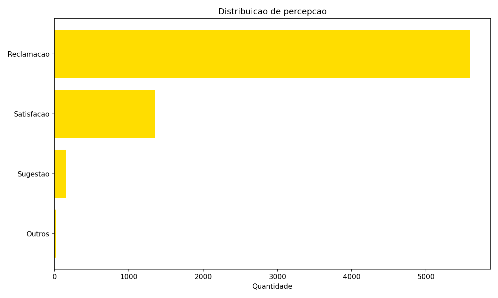
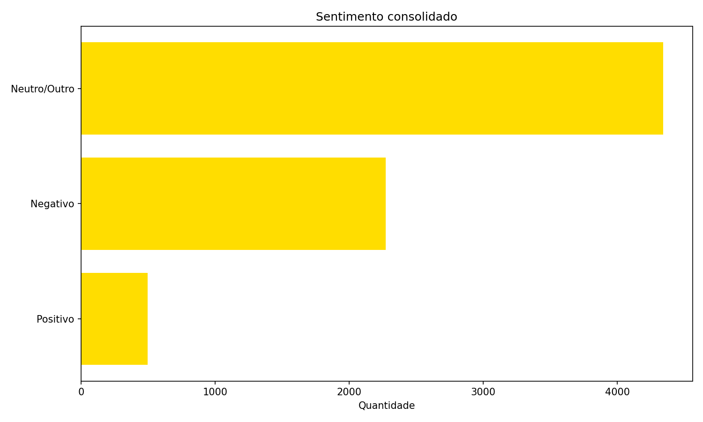
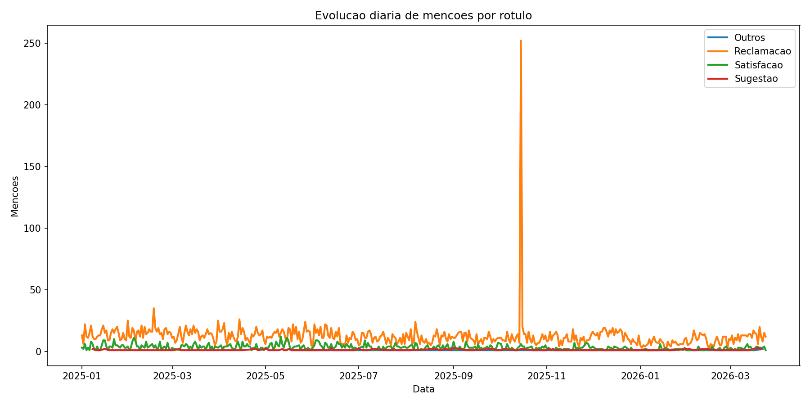
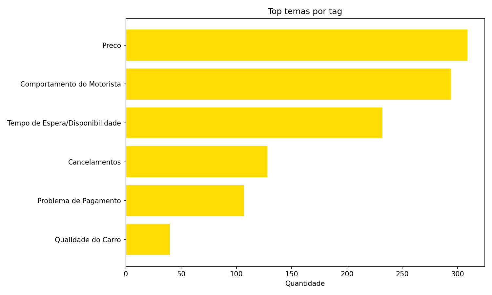

# Percepcão de Usuarios via Web Scraping
- [Percepcão de Usuarios via Web Scraping](#percepcão-de-usuarios-via-web-scraping)
  - [Base de dados e dicionario de colunas](#base-de-dados-e-dicionario-de-colunas)
  - [Visão executiva](#visão-executiva)
  - [Big numbers](#big-numbers)
  - [Leitura rapida](#leitura-rapida)
  - [Distribuicao de percepção](#distribuicao-de-percepção)
  - [Sentimento consolidado](#sentimento-consolidado)
  - [Evolucao diaria](#evolucao-diaria)
  - [Top temas por tag que moldam a percepção](#top-temas-por-tag-que-moldam-a-percepção)
  - [Proximos passos](#proximos-passos)
  - [Documentação Tecnica](#documentação-tecnica)
    - [Objetivo](#objetivo)
    - [O que foi feito](#o-que-foi-feito)
      - [Código salvo no GitHub](#código-salvo-no-github)
      - [Coleta de dados](#coleta-de-dados)
      - [Primeira versao dos filtros](#primeira-versao-dos-filtros)
      - [Estrategia de busca aplicada nesta versao](#estrategia-de-busca-aplicada-nesta-versao)
      - [Tratamento e consolidacao analitica](#tratamento-e-consolidacao-analitica)

## Base de dados e dicionario de colunas
- Base completa: [Google Sheets](https://docs.google.com/spreadsheets/d/1If2wWa5sSXJTmc5J2O6DfCPb8naOm5oGvhHSZFt8iLY/edit?usp=sharing)
- `id_tweet`: id da mensagem. Ao copiar o id e colar apos a URL do X, voce e redirecionado para a respectiva mencao no site oficial.
- `created_date`: data da publicacao.
- `created_time`: hora da publicacao.
- `full_text`: texto da publicacao onde a 99 foi mencionada.
- `view_count`: quantidade de visualizacoes.
- `retweet_count`: quantidade de reposts.
- `favorite_count`: quantidade de curtidas.
- `reply_count`: quantidade de respostas.
- `quote_count`: quantidade de citacoes.
- `id_user`: id da conta do usuario.
- `followers_count`: contagem de seguidores.
- `following_count`: contagem de pessoas que o usuario segue.
- `verified`: se o usuario assina o plano pago do X.
- `rotulo`: rotulo da publicacao usando Gemini com o prompt: `Crie uma nova coluna e categorize os textos dos tweets na coluna A usando os rotulos: 'Satisfacao', 'Reclamacao' e 'Sugestao'`.
- `resumo`: resumo da publicacao usando Gemini com o prompt: `Resuma em uma palavra o que essa pessoa sente a respeito do servico prestado pelo aplicativo de mobilidade 99, caso o texto nao esteja no contexto esperado retorne 'Outro'`.
- `Tag`: tag da publicacao usando Gemini com o prompt: `classifique o conteudo da mensagem em seguintes categorias: preco, tempo de espera ou disponibilidade, cancelamentos, comportamento do motorista, qualidade do carro, problema de pagamento e outros. Caso identifique mais de uma categoria, separe por virgula`.

## Visão executiva
- **922 mencoes analisadas** no X, com recorte de **01/01/2026 a 24/03/2026**.
- **2.607.164 views totais** e **59.569 interacoes**.
- **Reclamacao domina a conversa (81.6%)**, enquanto Satisfacao representa **14.3%**.
- Sentimento **Negativo** em **73.3%** dos casos.
- Na frente de reclamacoes, a principal alavanca e **Preço** (27.8% das reclamacoes com tag).

## Big numbers
- Mencoes analisadas: **922**
- Views totais: **2.607.164**
- Total de interacoes: **59.569**
- Percentual de reclamacao: **81.6%**
- Percentual de satisfacao: **14.3%**
- Percentual de sugestao: **2.7%**

## Leitura rapida
| O que olhar | Resultado |
| --- | --- |
| Pressao reputacional | Reclamacao em **81.6%** |
| Qualidade da experiencia | Negativo em **73.3%** dos resumos |
| Principal de ruido | **Preço** com **27.8%** das reclamacoes com tag |

## Distribuicao de percepção
| Rotulo | Quantidade | Percentual |
| --- | --- | --- |
| Reclamacão | 752 | 81.6% |
| Satisfacão | 132 | 14.3% |
| Sugestão | 25 | 2.7% |
| Outros | 13 | 1.4% |



## Sentimento consolidado
| Sentimento | Quantidade | Percentual |
| --- | --- | --- |
| Negativo | 676 | 73.3% |
| Neutro/Outro | 128 | 13.9% |
| Positivo | 118 | 12.8% |



## Evolucao diaria
Picos de **Reclamacao** por dia para relacionar com eventos operacionais (disponibilidade, preco e cancelamentos).



## Top temas por tag que moldam a percepção
| Tag | Quantidade | Percentual |
| --- | --- | --- |
| Preço | 309 | 27.8% |
| Comportamento do Motorista | 294 | 26.5% |
| Tempo de Espera/Disponibilidade | 232 | 20.9% |
| Cancelamentos | 128 | 11.5% |
| Problema de Pagamento | 107 | 9.6% |
| Qualidade do Carro | 40 | 3.6% |



## Proximos passos
1. **Ajustar as classificacoes:** expandir os rotulos de categorizacao e refinar os prompts para aumentar a precisao da segmentacao e reduzir agrupamentos genericos.
2. **Testar API oficial:** estimar o custo mensal e mapear quais campos adicionais podem enriquecer a analise (metadados, autoria, granularidade temporal e sinais de engajamento).
3. **Expandir para outros canais:** incluir **Reclame Aqui** e **LinkedIn** para ampliar cobertura de percepcao externa e comparar se os temas criticos se repetem entre canais.
4. **Criar painel de acompanhamento continuo:** disponibilizar uma aplicacao para monitoramento recorrente do que esta sendo dito, com alertas e leitura por tema critico.

## Documentação Tecnica
### Objetivo
Criar uma estrutura inicial de monitoramento de mencoes no X sobre a empresa para:
- identificar temas recorrentes
- capturar sinais de percepcao de marca
- apoiar analises de experiencia e operacao
- viabilizar base reutilizavel para novos estudos

### O que foi feito
#### Código salvo no GitHub
Por se tratar de um projeto de analise de dados, o codigo foi salvo no GitHub para garantir rastreabilidade, controle de versao e colaboracao futura. O repositorio se encontra privado para proteger o processo de coleta e tratamento dos dados, mas pode ser compartilhado mediante solicitacão. A base de dados fica apenas no Google Sheets, garantindo que nenhuma informação sensível seja exposta na rede aberta. Para solicitar acesso ao repositorio, entre em contato com o autor: Rafael Tegazzini (D117441).

#### Coleta de dados
- Estruturado processo de coleta via web scraping
- Busca historica por periodo e por query
- Abordagem sem custo de API nesta etapa

#### Primeira versao dos filtros
- idioma em portugues (`lang:pt`)
- exclusão de links (`-filter:links`)
- exclusão de replies (`-filter:replies`)
- exclusão de perfil especifico (`-from:voude99`)
- exclusão de termos de ruido (`-R$99 -99%`)
- recorte por periodo (`since:2026-01-01 until:2026-03-24`)

#### Estrategia de busca aplicada nesta versao
```text
99 (app OR corrida) -R$99 -99% lang:pt since:2026-01-01 until:2026-03-24 -filter:links -filter:replies -from:voude99
```

#### Tratamento e consolidacao analitica
- Normalizacao de rotulos, sentimentos e tags
- Quebra de tags multiplas por virgula
- Desenvolvimento de script em Python para remover mensagens onde `food` aparece, focando o recorte em mencoes de ride hailing
- Consolidacao de big numbers, distribuicoes, tendencias e temas prioritarios
- Geracao automatica de dashboard e documentacao executiva
